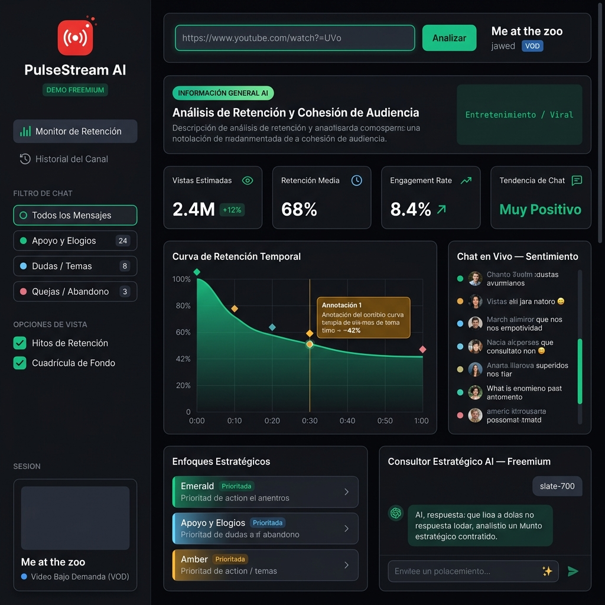

# Audience Pulse Stream Analyzer



Portfolio freemium de analítica GenAI para videos de YouTube. La app toma una URL pública, extrae señales básicas del video y genera un dashboard de retención, conversación y recomendaciones ejecutivas para creadores de contenido.

> Este repositorio existe para demostrar diseño de producto, integración GenAI, arquitectura full-stack ligera y criterio profesional de documentación. No es la versión premium completa.

## Qué demuestra

- Dashboard tipo producto SaaS para escritorio.
- Frontend React + Vite con componentes de analítica visual.
- Backend Express que protege la API key del lado servidor.
- Integración opcional con Gemini mediante `GEMINI_API_KEY`.
- Fallback heurístico local cuando no hay API key o la cuota falla.
- Separación clara entre demo freemium y capacidades premium.

## Stack técnico

- **React 19** + **TypeScript**
- **Vite** para desarrollo frontend
- **Express** como servidor full-stack local
- **Gemini API** mediante `@google/genai`
- **Tailwind CSS v4**
- **Lucide React** para iconografía
- **Motion** para microinteracciones

## Arquitectura resumida

```txt
Usuario
  │
  ├─ React dashboard
  │    ├─ Header / búsqueda de URL
  │    ├─ Métricas principales
  │    ├─ Curva de retención
  │    ├─ Insights de chat
  │    └─ Consultor AI freemium
  │
  └─ Express API
       ├─ POST /api/analyze-video
       │    ├─ Obtiene metadatos públicos de YouTube
       │    ├─ Usa Gemini si existe GEMINI_API_KEY
       │    └─ Usa fallback heurístico si no hay API key
       │
       └─ POST /api/ask-strategist
            └─ Respuesta ejecutiva capada en modo freemium
```

## Versión freemium incluida

La demo pública permite:

- Ejecutar el proyecto localmente.
- Configurar tu propia `GEMINI_API_KEY`.
- Analizar una URL pública de YouTube.
- Ver métricas estimadas, curva de retención, tendencias y enfoques estratégicos resumidos.
- Usar un consultor AI limitado para preguntas ejecutivas breves.

## Reservado para versión premium

La versión premium completa no está incluida en este repositorio. Quedan reservados:

- Asesor estratégico completo sin límite freemium.
- Planes paso a paso por objetivo de crecimiento.
- Guiones completos para Shorts y videos de seguimiento.
- Priorización avanzada por impacto esperado.
- Comparativas entre videos/canales.
- Integración profunda con fuentes privadas o autenticadas.
- Workflows de seguimiento por iteraciones.

Esto no es esconder código por inseguridad: es diseñar un producto con una frontera clara entre demostración pública y valor comercial.

## Instalación local

### 1. Clonar el repositorio

```bash
git clone <repo-url>
cd <repo-folder>
```

### 2. Instalar dependencias

```bash
npm install
```

### 3. Configurar variables de entorno

Copia el archivo de ejemplo:

```bash
cp .env.example .env.local
```

Luego edita `.env.local`:

```env
GEMINI_API_KEY="tu_api_key_de_gemini"
APP_URL="http://localhost:3000"
```

`GEMINI_API_KEY` es opcional para abrir la app, pero necesaria para probar el flujo GenAI real. Sin API key, el backend usa un generador heurístico local para mantener la demo funcional.

### 4. Ejecutar en desarrollo

```bash
npm run dev
```

Abre:

```txt
http://localhost:3000
```

## Scripts disponibles

```bash
npm run dev      # Ejecuta Express + Vite en modo desarrollo
npm run lint     # Verifica TypeScript sin emitir archivos
npm run start    # Ejecuta la versión compilada desde dist/server.cjs
```

> Nota: `npm run build` existe para producción, pero este repositorio está presentado principalmente como demo local freemium.

## API pública local

### `POST /api/analyze-video`

Analiza una URL de YouTube y devuelve:

- título y canal
- duración
- categoría
- resumen ejecutivo
- métricas estimadas
- curva de retención
- anotaciones principales
- mensajes/tendencias de chat resumidas
- enfoques estratégicos capados

### `POST /api/ask-strategist`

Devuelve una respuesta ejecutiva limitada. El asesor premium completo está intencionalmente fuera del repositorio público.

## Decisiones de producto

Esta app está pensada como portfolio profesional, no como "código regalado". La versión pública demuestra que el sistema funciona, pero no entrega el motor completo de consultoría estratégica.

La frontera freemium existe por tres motivos:

1. **Demostración real:** quien clona el proyecto puede correrlo y probar el flujo.
2. **Protección de valor:** las capacidades premium no se publican completas.
3. **Claridad profesional:** el README explica qué es demo, qué es producto y qué se mantiene privado.

## Aviso de uso

Copyright © 2026. Todos los derechos reservados.

Este repositorio se publica como material de portfolio y evaluación técnica. No se concede una licencia open source permisiva. No está autorizado copiar, redistribuir, revender o convertir este trabajo en un producto comercial sin permiso explícito del autor.

Puedes revisar el código, ejecutarlo localmente y evaluar la implementación freemium. Para cualquier uso más allá de evaluación técnica o aprendizaje personal, se requiere autorización previa.
